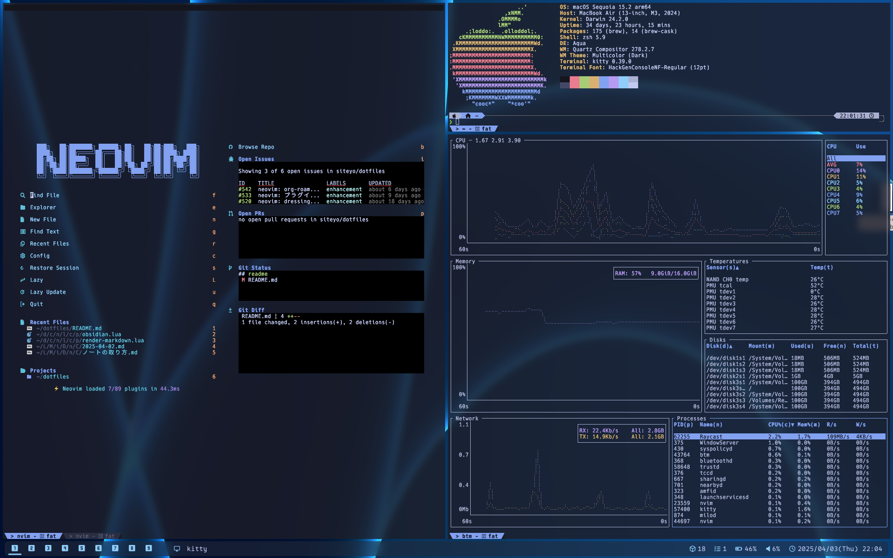

# siteyo's dotfiles

[](https://github.com/siteyo/dotfiles/actions/workflows/install-test-ubuntu.yml)
[](https://github.com/siteyo/dotfiles/actions/workflows/install-test-darwin.yml)
[](https://github.com/siteyo/dotfiles/actions/workflows/audit-dependency.yml)
[](https://github.com/siteyo/dotfiles/actions/workflows/nvim-startuptime.yml?query=branch%3Amain)




## Contents

* Terminal
  * [Wezterm](https://wezfurlong.org/wezterm/index.html)
  * [kitty](https://sw.kovidgoyal.net/kitty/)
* Editor
  * [Neovim](https://neovim.io/)
  * [LazyVim](https://www.lazyvim.org/)
* Package Manager
  * [Homebrew](https://brew.sh/)
  * [npm](https://www.npmjs.com/) (for neovim)
  * [rye](https://github.com/astral-sh/rye) (for neovim)
  * [aqua](https://aquaproj.github.io/)
* Shell
  * bash
  * zsh
  * [Sheldon](https://github.com/rossmacarthur/sheldon)
  * [Powerlevel10k](https://github.com/romkatv/powerlevel10k)
* Window Manager
  * [AeroSpace](https://github.com/nikitabobko/AeroSpace)
* Others
  * [Git](https://www.git-scm.com/)
  * [Sketchybar](https://felixkratz.github.io/SketchyBar/)
  * [Raycast](https://www.raycast.com/) (script commands only)
  * [aquaskk](https://github.com/codefirst/aquaskk)


## Font

The following fonts are used. On macOS, they are installed via Homebrew (`Brewfile-Darwin`). On WSL, manual installation is required.

* [FiraCode](https://github.com/tonsky/FiraCode)
* [HackGen](https://github.com/yuru7/HackGen/releases)
* [0xProto](https://github.com/0xType/0xProto)

## How to Setup

Run the following command to install everything.
Note: On macOS, you may need to install Homebrew first.

```bash
make install
```

For all available options, run:

```bash
make help
```

## Requirements

See the official Homebrew documentation for requirements.

* [macOS](https://docs.brew.sh/Installation#macos-requirements)
* [Linux](https://docs.brew.sh/Homebrew-on-Linux#requirements)

## HHKB Settings

See [here](./etc/hhkb/README.md) for HHKB mapping settings.

